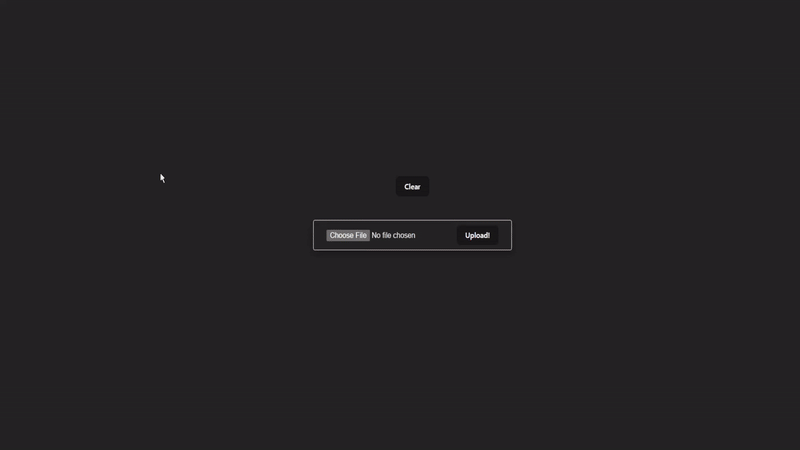

# Car Detection App
> An app for car detection using traditional machine learning algorithms (SVM) 

## Description
//to be added
## Interface

## Features

- Multiple cars detection.
- Accurate object detection of cars.
- Simple interface to allow users to test the model.

## Getting Started
- ### Server Setup
1. Clone the repository to your local machine:
    `git clone https://github.com/mohammedshady/car-detection.git`
2. Navigate to the server directory:
    `cd backend`
3. Install the required dependencies in the requriements.txt:
    `pip install -r requirements.txt`
6. Start the Flask server:
    `python app.py`

- ### Interface Setup
1. Navigate to the client directory:
    `cd car-detection`
2. Install the required dependencies:
    `npm install`
3. Start the React development server:
    `npm run dev`
4. Access the application in your web browser at `http://localhost:5173`.

## Future Updates
Further improvments include :
- [ ] Remove unnecessary code that was used for testing different features.
- [ ] Oversample dataset to detect cars from all angles instead of (rear + side) view only.
- [ ] Enhance the user interface for improved usability and design.
- [ ] Optimize code for faster and easier detection.

## Authors
- **Mohammed Shady** - _GitHub Profile_: [mohammedshady](https://github.com/mohammedshady) | _Email_: mohatech777@gmail.com

If you encounter any issues or have suggestions for improvements, please reach out via email. Your feedback is valuable and helps us enhance the app for everyone.
